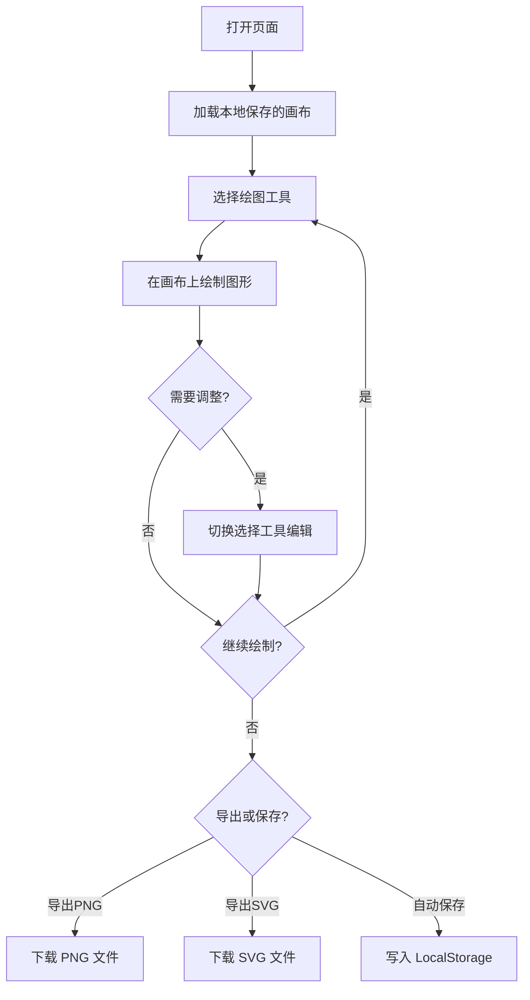

## 1. 产品概述

SketchPad 是一款轻量化的手绘风格在线白板工具，作为 Excalidraw 的极简平替方案。主要为需要快速绘制草图、流程图、示意图的用户提供简洁高效的绘图体验。

- 核心目标：提供极简、流畅、无干扰的手绘风格绘图体验
- 目标用户：产品经理、设计师、开发者、教育工作者
- 市场价值：无需注册、无需复杂学习、打开即用的轻量化绘图工具

## 2. 核心功能

### 2.1 用户角色

| 角色 | 注册方式 | 核心权限 |
|------|----------|----------|
| 普通用户 | 无需注册 | 完整绘图、导出、本地保存功能 |

### 2.2 功能模块

1. **主画布页面**：手绘风格画布、工具栏、属性面板
2. **工具系统**：选择工具、矩形、线条、文本
3. **历史记录**：撤销、重做操作
4. **导出系统**：PNG 导出、SVG 导出
5. **存储系统**：本地自动保存、手动保存

### 2.3 页面详情

| 页面名称 | 模块名称 | 功能描述 |
|-----------|-------------|---------------------|
| 主画布页面 | 顶部工具栏 | 工具选择、撤销重做、导出按钮、保存状态显示 |
| 主画布页面 | 侧边工具栏 | 绘图工具图标（选择/矩形/线条/文本）、颜色选择器、线宽选择 |
| 主画布页面 | 画布区域 | 无限画布、手绘风格渲染、图形选择与编辑、画布平移缩放 |
| 主画布页面 | 属性面板 | 选中图形的颜色、线宽、字号等属性调整 |

## 3. 核心流程

用户打开页面后，直接进入空白画布。选择绘图工具（矩形/线条/文本），在画布上绘制图形。可随时切换选择工具调整图形位置和大小，通过撤销/重做修正操作。完成绘制后可导出为 PNG 或 SVG 格式，或依赖浏览器本地存储自动保存画布内容。

## 4. 用户界面设计

### 4.1 设计风格

- **主色调**：米白色画布背景 (#FFFEF7)，深灰色工具栏 (#2C2C2C)，珊瑚红作为强调色 (#FF6B6B)
- **辅助色**：多种手绘笔颜色（黑、红、蓝、绿、黄、紫）
- **按钮风格**：极简圆角方形图标按钮，hover 时微亮背景，选中时珊瑚红边框
- **字体**：标题使用 "Caveat" 手写字体，正文和 UI 使用 "Segoe UI" 无衬线字体
- **布局风格**：顶部水平工具栏 + 左侧垂直工具栏 + 中央画布 + 右侧属性面板
- **图标风格**：极简线性图标，统一 20x20 尺寸
- **手绘效果**：所有图形渲染时添加细微抖动，模拟手绘线条的自然感

### 4.2 页面设计概述

| 页面名称 | 模块名称 | UI 元素 |
|-----------|-------------|-------------|
| 主画布页面 | 顶部工具栏 | 深色背景、白色图标按钮、分隔线、保存状态指示灯、导出下拉菜单 |
| 主画布页面 | 侧边工具栏 | 浅色背景卡片、工具图标按钮组、颜色调色板、线宽滑块 |
| 主画布页面 | 画布区域 | 米白色背景、极淡网格点、图形手绘渲染、选中状态虚线框 |
| 主画布页面 | 属性面板 | 半透明白色卡片、滑出动画、颜色选择、字号调整、删除按钮 |

### 4.3 响应式

桌面端优先设计，适配常见分辨率（1280x720 及以上）。移动端简化工具栏布局，画布区域支持触摸手势。

