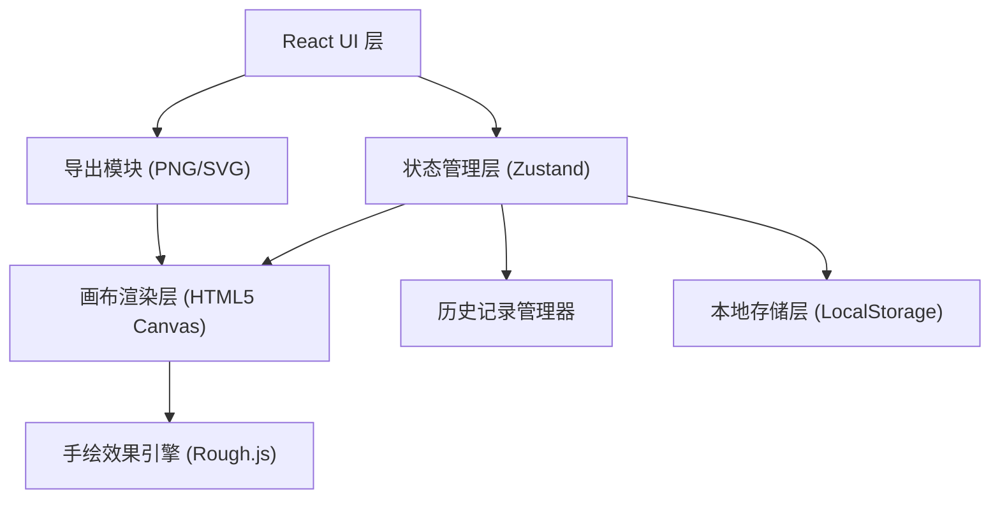
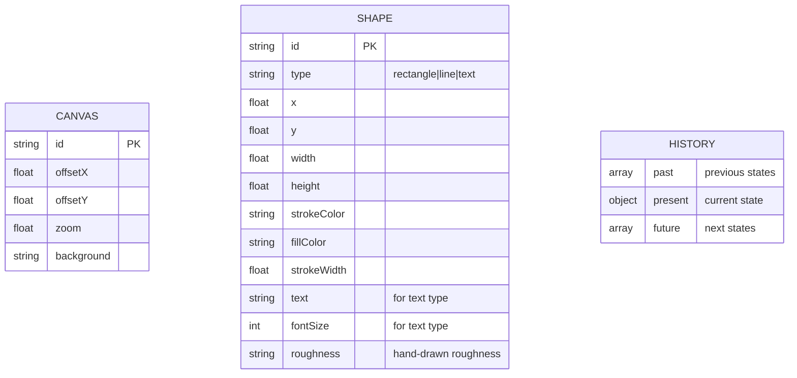

## 1. 架构设计



## 2. 技术描述

- **前端框架**：React 18 + TypeScript 5
- **构建工具**：Vite 5
- **样式方案**：Tailwind CSS 3
- **状态管理**：Zustand 4
- **图标库**：Lucide React
- **手绘渲染**：Rough.js (提供手绘风格线条和图形)
- **后端**：无（纯前端项目）
- **存储**：浏览器 LocalStorage
- **初始化方式**：使用 `vite-init` 的 `react-ts` 模板

## 3. 路由定义

| 路由 | 用途 |
|-------|---------|
| / | 主画布页面（唯一页面） |

## 4. 数据模型

### 4.1 数据模型定义



### 4.2 TypeScript 类型定义

```typescript
type ShapeType = 'rectangle' | 'line' | 'text';
type ToolType = 'select' | ShapeType;

interface BaseShape {
  id: string;
  type: ShapeType;
  x: number;
  y: number;
  strokeColor: string;
  fillColor: string;
  strokeWidth: number;
  roughness: number;
}

interface RectangleShape extends BaseShape {
  type: 'rectangle';
  width: number;
  height: number;
}

interface LineShape extends BaseShape {
  type: 'line';
  x2: number;
  y2: number;
}

interface TextShape extends BaseShape {
  type: 'text';
  text: string;
  fontSize: number;
}

type Shape = RectangleShape | LineShape | TextShape;

interface CanvasState {
  shapes: Shape[];
  selectedId: string | null;
  offsetX: number;
  offsetY: number;
  zoom: number;
}

interface AppState {
  canvas: CanvasState;
  currentTool: ToolType;
  currentColor: string;
  currentStrokeWidth: number;
  canUndo: boolean;
  canRedo: boolean;
}
```

## 5. 项目目录结构

```
src/
├── components/
│   ├── Canvas/              # 画布组件
│   │   ├── Canvas.tsx       # 主画布容器
│   │   ├── CanvasRenderer.ts # Canvas 渲染逻辑
│   │   └── useCanvasEvents.ts # 画布事件处理 Hook
│   ├── Toolbar/             # 工具栏组件
│   │   ├── TopToolbar.tsx   # 顶部工具栏
│   │   └── LeftToolbar.tsx  # 左侧工具栏
│   ├── PropertyPanel/       # 属性面板
│   │   └── PropertyPanel.tsx
│   └── ExportMenu/          # 导出菜单
│       └── ExportMenu.tsx
├── hooks/
│   ├── useHistory.ts        # 撤销重做 Hook
│   └── useLocalStorage.ts   # 本地存储 Hook
├── store/
│   └── useCanvasStore.ts    # Zustand 状态管理
├── utils/
│   ├── roughRenderer.ts     # 手绘渲染工具
│   ├── exportUtils.ts       # 导出工具 (PNG/SVG)
│   └── idGenerator.ts       # ID 生成工具
├── types/
│   └── index.ts             # 全局类型定义
├── App.tsx
├── main.tsx
└── index.css
```

